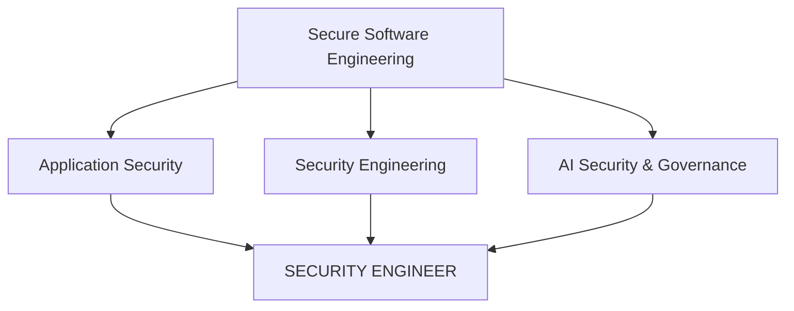

[<!-- ───────────────────────── HEADER ───────────────────────── -->

  

  

  
  
  
  

<h3 align="center">Build it. Break it. Secure it. Automate it.</h3>

 

<!-- ───────────────────────── ABOUT ───────────────────────── -->
## 👋 About me

I'm a **cybersecurity and full-stack professional** with experience across security assurance, IT controls, application security, secure software development, automation, and AI governance.

I work at the intersection of **security and engineering**: understanding how applications are built, finding how they can fail or be exploited, and building practical solutions that make systems more secure. I'm building toward **Application Security / Security Engineering**, using my software-development background to approach security as an engineer.

<table>
  <tr>
    <td width="50%" valign="top">
      <h3>🛡️ Application Security</h3>
      Secure SDLC, web and API security, threat modeling, and hands-on vulnerability testing.
    </td>
    <td width="50%" valign="top">
      <h3>🤖 AI Security & Governance</h3>
      Where artificial intelligence, cybersecurity, and governance meet: LLM risks, frameworks, and controls.
    </td>
  </tr>
  <tr>
    <td width="50%" valign="top">
      <h3>💻 Full-Stack Development</h3>
      Production-style web applications, APIs, and services, built with security in mind.
    </td>
    <td width="50%" valign="top">
      <h3>📊 Assurance, GRC & Risk</h3>
      Security assurance, ITGC, cloud and third-party risk, security automation, and data-driven controls.
    </td>
  </tr>
</table>

 

<!-- ───────────────────────── SECURITY ───────────────────────── -->
## 🔐 Cybersecurity

| Area | Skills |
|---|---|
| **AppSec practices** | Secure SDLC · Threat Modeling · Secure Coding · Security Testing · Vulnerability Assessment |
| **Web & API security** | OWASP Top 10 · OWASP API Security · Authentication & Authorization · RBAC & Access Control · Session & Cookie Security · Input Validation |
| **Vulnerability classes** | SQL Injection · XSS · CSRF · SSRF · Security Misconfiguration · Dependency & Configuration Security |
| **Assurance & GRC** | Security Assurance · ITGC · ITAC · Vulnerability Management · Cloud & Third-Party Risk |
| **Hands-on labs** | Burp Suite · OWASP Juice Shop · DVWA |

  
  
  
  
  

 

<!-- ───────────────────────── AI SECURITY ───────────────────────── -->
## 🤖 AI security & governance

| | Frameworks & standards | Focus areas |
|---|---|---|
| **Governance** | NIST AI RMF · ISO/IEC 42001 · EU AI Act | AI Risk Management · AI System Classification · Model Risk · AI Security Controls · Responsible AI · AI Compliance |
| **Security** | OWASP Top 10 for LLM Applications · MITRE ATLAS | Prompt Injection · Data Leakage · RAG Security · LLM & AI Application Security · Model & System Threat Modeling · AI Red Teaming Concepts · Secure AI Development |

 

<!-- ───────────────────────── ENGINEERING ───────────────────────── -->
## 💻 Software engineering

My security work is backed by hands-on experience building production-style applications.

<table>
  <tr>
    <td width="170"><b>Frontend</b></td>
    <td></td>
  </tr>
  <tr>
    <td><b>Backend & databases</b></td>
    <td></td>
  </tr>
  <tr>
    <td><b>Languages</b></td>
    <td></td>
  </tr>
  <tr>
    <td><b>Data & cloud</b></td>
    <td>Pandas · SQL · Power BI · AWS / Cloud Security Fundamentals</td>
  </tr>
  <tr>
    <td><b>What I build</b></td>
    <td>REST APIs · Authentication & Authorization · RBAC · Database Design · API & Payment Integrations · Admin Dashboards · Responsive Web Apps · Automation</td>
  </tr>
</table>

 

<!-- ───────────────────────── DIRECTION ───────────────────────── -->
## 🔭 What I'm working toward

  <b>Application Security → Security Engineering → Cloud Security → AI Security</b>

 

<!-- ───────────────────────── FEATURED WORK ───────────────────────── -->
## 🚀 Featured work

Projects that combine software engineering, security, automation, and AI. Browse them all in [my repositories](https://github.com/samiramrullah?tab=repositories).

<table>
  <tr>
    <td width="33%" valign="top">
      <h3>🔐 Security</h3>
      <ul>
        <li>Web application security labs</li>
        <li>OWASP vulnerability testing</li>
        <li>API security testing</li>
        <li>Authentication & authorization implementations</li>
        <li>Secure coding experiments</li>
        <li>Security automation</li>
      </ul>
    </td>
    <td width="33%" valign="top">
      <h3>💻 Full-stack</h3>
      <ul>
        <li>React / Next.js applications</li>
        <li>Node.js APIs</li>
        <li>Python services</li>
        <li>MongoDB / MySQL applications</li>
        <li>E-commerce systems</li>
        <li>Admin dashboards and payment integrations</li>
      </ul>
    </td>
    <td width="33%" valign="top">
      <h3>🤖 AI / ML</h3>
      <ul>
        <li>Machine learning applications</li>
        <li>Computer vision projects</li>
        <li>AI-powered applications</li>
        <li>AI governance & security experiments</li>
      </ul>
    </td>
  </tr>
</table>

<!-- To pin real repositories here, replace REPO_ONE / REPO_TWO with repo names
     and delete the comment markers around this block.

  
  

-->

 

<!-- ───────────────────────── STATS ───────────────────────── -->
## 📊 GitHub stats

  
  

  

 

<!-- ───────────────────────── CREDENTIALS ───────────────────────── -->
## 🏆 Credentials

- 🛡️ **EC-Council Certified Ethical Hacker (C|EH v12)**
- 🎓 **B.Tech, Computer Science & Engineering**

**Currently deepening:** Application Security · Cloud Security · AI Security & Governance · Security Assurance & IT Controls

 

<!-- ───────────────────────── CONNECT ───────────────────────── -->
## 📫 Let's connect

Happy to talk about **Application Security · Security Engineering · Secure Software · AI Security & Governance · Full-Stack Engineering**.

  
  

  <i>Security-minded engineer who likes to understand how things work, and how they can break.</i>

  

](https://www.samiramrullah.com/)
